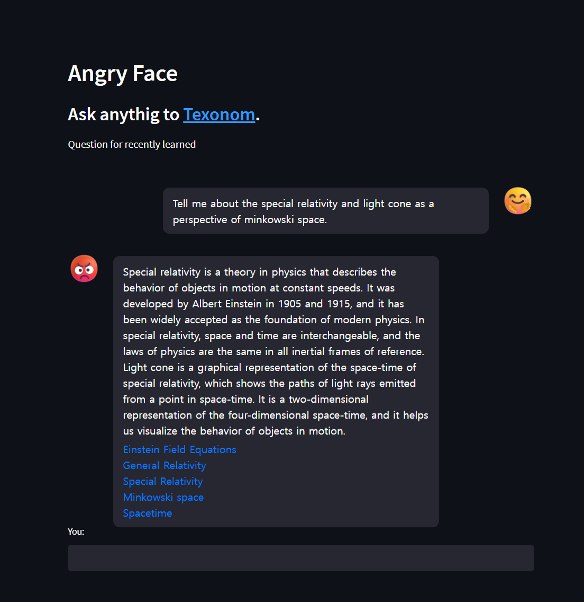

# Angryface

Angry for priceless AI products. pursuing local, private and personal AI who studies and answers using your own documents.

<p align="center">

</p>

This project was inspired by the [langchain](https://github.com/hwchase17/langchain) projects like [notion-qa](https://github.com/hwchase17/notion-qa), [localGPT](https://github.com/PromtEngineer/localGPT) and so on.
This project is POC project for [Texomata](https://github.com/texonom/texomata) (browser chat AI). Currently CLO, web UI supports only.



<figcaption align = "center"><b>may differ from the actual page</b></figcaption>
<br/>

## Install

This project is using [rye](https://mitsuhiko.github.io/rye/) as package manager

```
rye sync

# For cuda support
CUDA_VERSION=cu118
TORCH_VERSION=2.0.1
pip install torch==$TORCH_VERSION --index-url https://download.pytorch.org/whl/$CUDA_VERSION --force
pip install torch==$TORCH_VERSION --index-url https://download.pytorch.org/whl/$CUDA_VERSION
```

## Run

Currently only available with [CUDA](https://texonom.com/a9e934a523d346c5a984d95e3d0676e3)

1. Ingest documents
2. QA to Chat AI

### 1. Ingest

```zsh
# Put document files to ./knowledge folder
python main.py ingest
# Or use provided Texonom DB
git clone https://huggingface.co/datasets/texonom/angryface db
```

### 2. Chat with Web UI

```zsh
streamlit run chat.py
```

### 2. Chat with CLI

```zsh
python main.py chat
```

## Future Plan

- [ ] [MPS](https://texonom.com/8d71e4de36e4416c83f65ee7bdaa412b) support using dynamic model selecting
- [ ] Stateful Web App support like [chat-langchain](https://chat.langchain.dev/)

## App Stack

### LLM Stack

- [Langchain](https://texonom.com/945567c597364cbb98336ca08c059856) for Prompt Engineering
- [ChromaDB](https://texonom.com/8af886db7d684e03911a86b652620816) for storing embeddings
- [Transformers](https://texonom.com/f5101287cc9249ab812e281e374e5629) for LLM engine
- [AutoGPTQ](https://github.com/PanQiWei/AutoGPTQ) for Quantization & Inference

### Python Stack

- [Rye](https://texonom.com/rye-429b5d5f3d7f4026ab5d1abd61facc73) for package management
- [Mypy](https://texonom.com/8a894731430f4138ac0fdd522cd74772) for type checking
- [Fire](https://github.com/google/python-fire) for CLI implementation
- [Streamlit](https://texonom.com/9e295c64d27e4999878a022b1c538964) for Web UI implementation
